<authentication_analysis>
- Przepływy autentykacji (wg PRD i spec):
  - Rejestracja (US-001): formularz → POST /api/auth/register → e‑mail
    weryfikacyjny → /auth/callback (code→sesja) → redirect do /generate.
  - Logowanie (US-002): formularz → POST /api/auth/login → setAll cookies
    (access/refresh) → redirect do /generate lub redirectTo.
  - Reset hasła (US-003): formularz → POST /api/auth/reset-password → e‑mail
    recovery → /auth/callback?type=recovery (code→sesja) → /auth/new-password
    → POST /api/auth/update-password → sukces.
  - Wylogowanie (US-004): POST /api/auth/logout → signOut → czyszczenie cookies
    → redirect do /auth/login.
  - Ochrona tras: middleware SSR sprawdza sesję (supabase.auth.getUser()),
    publiczne: /auth/* i /api/auth/*, reszta chroniona; brak sesji →
    302 do /auth/login?redirectTo=… (SSR) lub 401 problem+json (API).
  - Sesja i odświeżanie: @supabase/ssr + cookies.getAll/setAll; getUser()
    automatycznie odświeża access token przy ważnym refresh tokenie;
    w razie braku/wygaśnięcia refresh → stan „niezalogowany”.

- Główni aktorzy i interakcje:
  - Przeglądarka: wysyła żądania (credentials: include), renderuje strony,
    obsługuje przekierowania.
  - Middleware (Astro): tworzy SSR klienta Supabase, weryfikuje sesję,
    ustawia locals (supabase, user), dodaje x-request-id.
  - Astro API/SSR: endpointy /api/auth/* oraz chronione /api/* i strony SSR.
  - Supabase Auth: signUp, signIn, signOut, resetPassword, updateUser,
    exchange code→session, odświeżanie tokenów.

- Weryfikacja i odświeżanie tokenów:
  - Przy każdym żądaniu getUser() sprawdza access token; gdy wygasł, klient
    SSR używa refresh tokena z cookies do odświeżenia sesji (setAll).
  - Gdy refresh jest nieważny/brak → brak usera; middleware przekieruje (SSR)
    lub zwróci 401 (API).

- Kroki (skrót):
  - Rejestracja: POST /api/auth/register → e‑mail → /auth/callback → sesja → 302.
  - Logowanie: POST /api/auth/login → sesja (cookies) → 302.
  - Reset: POST /api/auth/reset-password → e‑mail → callback →
    /auth/new-password → POST /api/auth/update-password → 200.
  - Wylogowanie: POST /api/auth/logout → czyszczenie cookies → 302.
  - Ochrona: GET /generate → middleware getUser() → allow/redirect.
  - API: POST /api/generations → getUser() → 200 lub 401 problem+json.

```mermaid
sequenceDiagram
autonumber
participant Browser as Przeglądarka
participant Middleware as Middleware (Astro)
participant API as Astro API/SSR
participant Auth as Supabase Auth

%% Logowanie
Browser->>Middleware: POST /api/auth/login
Middleware->>API: Przekaż żądanie (+SSR klient)
API->>Auth: signInWithPassword
Auth-->>API: Sesja lub błąd
alt Sukces
  API->>Browser: Set-Cookie (setAll access/refresh)
  API-->>Browser: 200 JSON {user}
  Browser->>Middleware: GET /generate (redirect)
  Middleware->>API: Allow (z user)
  API-->>Browser: 200 Strona generate
else Błędne dane
  API-->>Browser: 401 problem+json
end

%% Rejestracja → e‑mail → callback
Browser->>Middleware: POST /api/auth/register
Middleware->>API: Przekaż żądanie
API->>Auth: signUp (email, hasło,
API->>Auth: redirectTo /auth/callback)
Auth-->>API: OK (e‑mail wysłany)
API-->>Browser: 200 JSON (instrukcja e‑mail)
Note over Browser,Auth: Link: /auth/callback?type=signup&code=…

Browser->>Middleware: GET /auth/callback?type=signup&code=…
Middleware->>API: Przekaż żądanie
API->>Auth: code → session
Auth-->>API: Sesja
API->>Browser: Set-Cookie (setAll)
API-->>Browser: 302 → /generate

%% Reset hasła
Browser->>Middleware: POST /api/auth/reset-password
Middleware->>API: Przekaż żądanie
API->>Auth: resetPasswordForEmail
Auth-->>API: OK (e‑mail)
API-->>Browser: 200 JSON (komunikat neutralny)
Note over Browser,Auth: Link: /auth/callback?type=recovery&code=…

Browser->>Middleware: GET /auth/callback?type=recovery&code=…
Middleware->>API: Przekaż żądanie
API->>Auth: code → session
Auth-->>API: Sesja (tymczasowa)
API->>Browser: Set-Cookie (setAll)
API-->>Browser: 302 → /auth/new-password

Browser->>Middleware: POST /api/auth/update-password
Middleware->>API: Przekaż żądanie
API->>Auth: updateUser (password)
Auth-->>API: OK
API-->>Browser: 200 JSON (hasło zaktualizowane)

%% Wylogowanie
Browser->>Middleware: POST /api/auth/logout
Middleware->>API: Przekaż żądanie
API->>Auth: signOut
Auth-->>API: OK
API->>Browser: Wyczyść cookies (setAll z pustymi)
API-->>Browser: 302 → /auth/login

%% Ochrona strony SSR (/generate)
Browser->>Middleware: GET /generate
Middleware->>Auth: getUser() z cookies
Auth-->>Middleware: user lub null
alt user
  Middleware->>API: Allow (locals.user)
  API-->>Browser: 200 Strona generate
else brak sesji
  Middleware-->>Browser: 302 → /auth/login?redirectTo=/generate
end

%% Ochrona API (np. /api/generations)
Browser->>Middleware: POST /api/generations
Middleware->>Auth: getUser() z cookies
Auth-->>Middleware: user lub null
alt user
  Middleware->>API: Przekaż (locals.user)
  API-->>Browser: 200 JSON
else brak sesji
  Middleware-->>Browser: 401 problem+json
end

%% Odświeżanie tokenu
Note over Middleware,API: x-request-id dodany do odpowiedzi
Browser->>Middleware: Dowolne żądanie chronione
Middleware->>Auth: getUser()
alt Access wygasł, refresh ważny
  Auth-->>Middleware: Nowa sesja (odświeżona)
  Middleware->>Browser: Set-Cookie (rotacja setAll)
else Brak/expired refresh
  Auth-->>Middleware: Brak sesji
  alt SSR strona
    Middleware-->>Browser: 302 → /auth/login
  else API
    Middleware-->>Browser: 401 problem+json
  end
end
```

</authentication_analysis>

<mermaid_diagram>

</mermaid_diagram>
